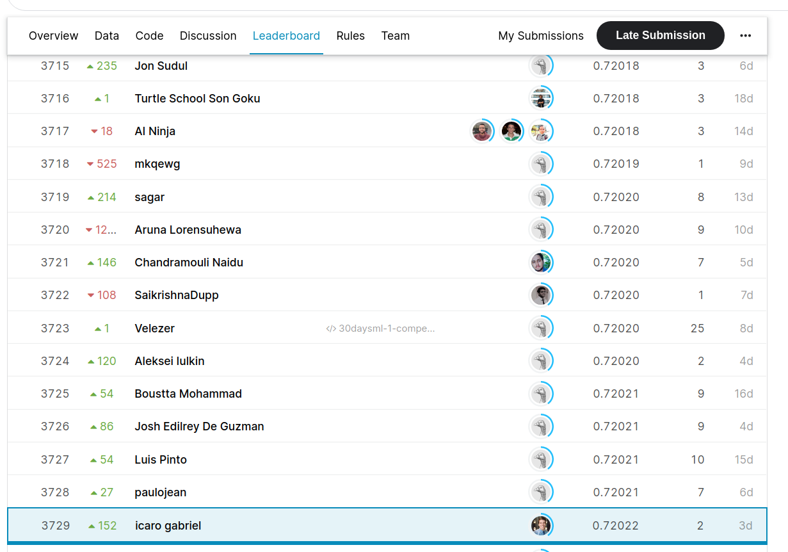

# 30 Days of ML competition

## Descrição
Repositório criado para resolver o desafio 30 Days of ML competition. A solução envolve quatro scripts, o primeiro (eda.py) realiza toda a parte da análise exploratória dos dados, o segundo (etl.py) faz a extração, transformação e carregamento da nova base de dados. O terceiro script é o (train.py), onde é feito a criação e treinamento do modelo LightGBM, e, por último, (test.py) responsável pela predição da base de teste.

## Instalação
1. Baixe o arquivo zip desse repositório 
2. Instale [virtualenv](https://virtualenv.pypa.io/en/latest/installation.html)
3. Navegue até o repositório onde o arquivo foi extraído e crie um ambiente virtual com `virtual env`
4. Ative o ambiente com `source env/bin/activate`
5. Instale a dependências com `pip install -r requirements.txt`
6. Execute os scripts na seguinte ordem eda.py -> feature.py -> model.py -> predict.py
7. Divirta-se

## Técnicas e modelo utilizado
* Label encoder
* One-Hot encoder
* Random Grid
* K-fold
* LightGBM

## Resultado
Nesta comeptição, consegui a posição 3729 de mais de 7500 participantes
 
